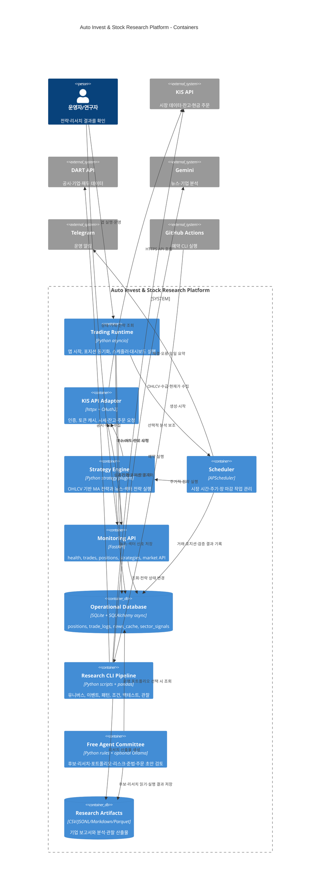

# C4 컨테이너 구조

## 컨테이너 경계의 의미

- `Trading Runtime`과 `Research CLI Pipeline`은 모두 Python이지만 실행 목적과 상태 경계가 다르다.
- 운영 DB는 소수의 최신 운영 상태와 거래 기록을 보관한다.
- 리서치 결과는 파일 중심이며, 날짜별 스냅샷과 관찰 로그가 분석의 장기 상태다.
- `Free Agent Committee`는 실제 broker API를 호출하지 않는 안전한 주문 초안 단계다.

