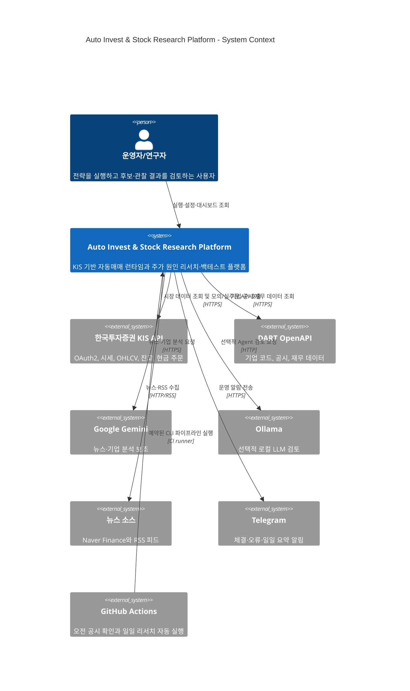

# C4 시스템 컨텍스트

## 컨텍스트 해석

운영자는 두 가지 작업을 수행한다.

1. KIS API에 연결된 자동매매 앱을 모의투자 또는 실거래 모드로 운영한다.
2. 기업 보고서와 시장 데이터를 기반으로 리서치·백테스트·관찰 결과를 검토한다.

GitHub Actions는 사람이 직접 실행하지 않아도 리서치 결과를 갱신하고 변경 사항을 commit/push한다. Telegram은 명령 채널이 아니라 결과·오류 알림 채널이다.

