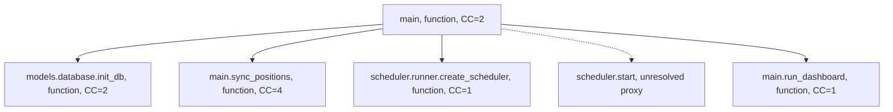
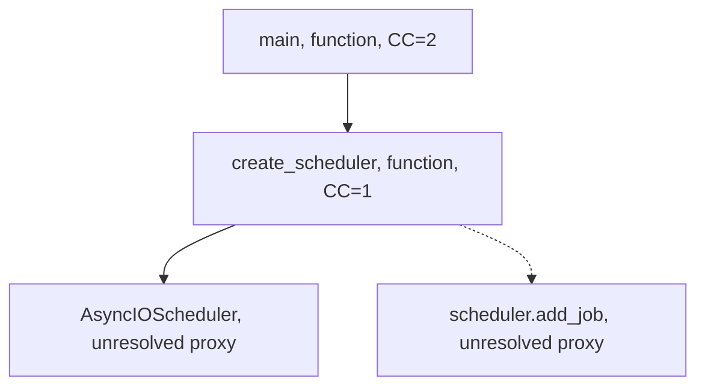
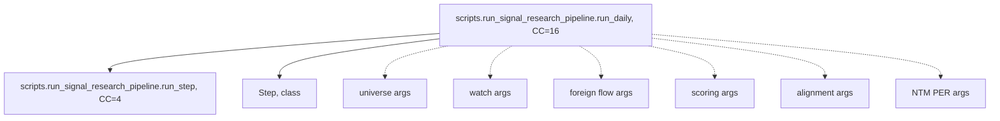

# 코드 그래프와 복잡도 결과

## Trailmark 분석 결과

```text
Trailmark 0.5.0
Nodes: 3992
  Functions: 1024
  Classes: 47
  Proxies: 2775
Call edges: 11088
Entrypoints: 64
```

프록시가 많은 이유는 외부 라이브러리, 동적 메서드 접근, ORM·스케줄러 객체 호출이 정적 그래프에서 완전히 해석되지 않기 때문이다. 프록시는 누락된 코드가 아니라 해석되지 않은 호출 후보로 해석해야 한다.

## `main:main` 호출 그래프

아래는 Trailmark native `call-graph`, focus `main:main`, depth 1 출력의 핵심 부분이다.



## `create_scheduler` 호출 그래프



`add_job` 엣지는 실제로 MA, 뉴스, 섹터, 일일 요약, 검증, 외국인 수급 작업에 대해 반복된다.

## `run_daily` 호출 그래프



실제 `run_step` 실행 대상은 유니버스·밸류에이션·관심종목·수급·외국인 흐름·스코어·정배열·NTM PER 관찰 스크립트다.

## 복잡도 집중 영역

Trailmark threshold 15 기준으로 다음 영역이 우선적인 유지보수 후보로 나타났다.

- `scripts/candlestick_patterns.py:detect_at` — CC 205
- `scripts/quarterly_stock_analysis.py:make_report` — CC 44
- `scripts/run_daily_research_summary.py:build_telegram_message` — CC 45
- `core/agents/free_pipeline.py:TraderAgent.run` — CC 28
- `core/agents/free_pipeline.py:ComplianceOfficerAgent.run` — CC 25
- `core/agents/free_pipeline.py:PortfolioManagerAgent.run` — CC 24
- `scheduler/runner.py:run_strategy` — CC 17
- `scripts/backtest/engine.py:run_backtest` — CC 31

## 그래프 한계

`module-deps` 다이어그램은 현재 Trailmark 실행에서 `No import edges found`를 반환했다. 따라서 모듈 지도는 Python AST import 스캔과 실제 import 목록을 함께 사용했다. 특히 `scripts`는 `sys.path` 삽입, 동적 subprocess, 상대·절대 import 혼용이 있어 import 그래프만으로 런타임 연결을 완전히 표현할 수 없다.

