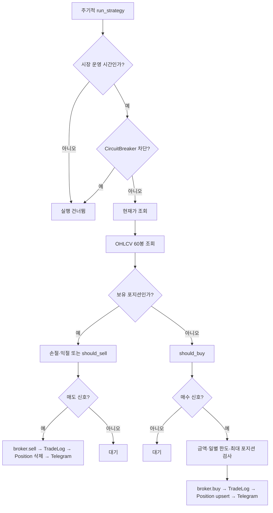
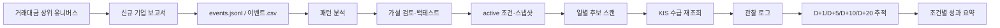
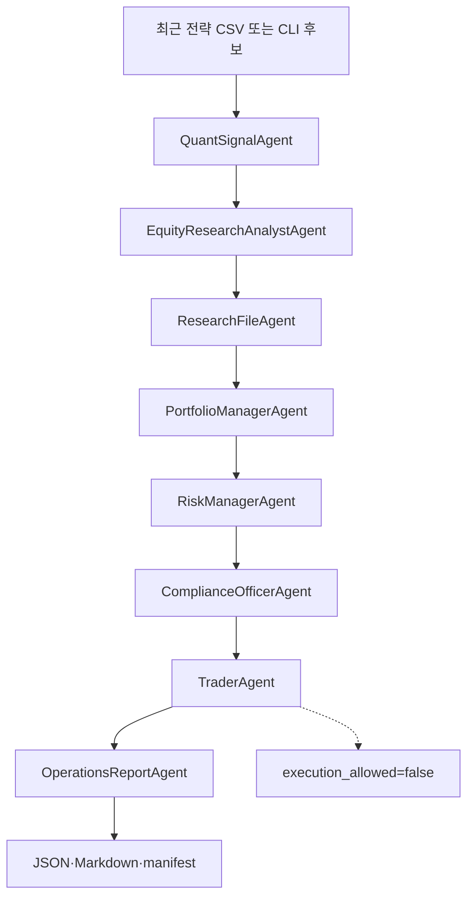

# 실행 흐름

## 1. 운영 앱 시작

```mermaid
sequenceDiagram
  participant O as 운영자
  participant M as main.py
  participant DB as SQLite/SQLAlchemy
  participant B as KIS Broker
  participant S as APScheduler
  participant D as FastAPI

  O->>M: python main.py
  M->>DB: init_db()
  M->>B: get_balance()
  B-->>M: 현재 보유 잔고
  M->>DB: positions 삭제 후 재생성
  M->>S: create_scheduler(); start()
  M->>D: uvicorn Server serve()
```

## 2. 스케줄러의 매매 판단



## 3. 스케줄 작업

| Job ID | 주기 | 역할 |
| --- | --- | --- |
| `ma_cross` | 5분 | `MACrossStrategy` 실행 |
| `news_crawl` | 설정값 분 | 뉴스 수집·Gemini 감성 분석 |
| `news_sentiment` | 5분 | 대기 중 뉴스 신호 소비 |
| `sector_crawl` | 10분 | 업종 뉴스 감성 분석 |
| `daily_summary` | 평일 15:35 | 당일 매매 손익 Telegram |
| `sector_validation` | 평일 15:40 | 섹터 예측 적중률 검증 |
| `foreign_flow_observation` | 평일 16:20 | 외국인 수급 관찰 스크립트 실행 |

## 4. 일일 리서치 파이프라인



`run_signal_research_pipeline.py --mode daily`는 현재 다음 종류의 관찰을 조합한다.

- active 전략 후보
- 외국인 연속 순매수·순매도
- 팩터 스코어
- 단기·장기 이동평균 정배열
- NTM PER/PEG
- 필요 시 캔들·신규 조건 관찰

## 5. Free Agent Committee



Agent는 종목 코드·리서치 파일·포트폴리오·현금·유동성·섹터 집중도를 검사하고, `buy/sell/hold` 제안과 human checklist를 만든다. 실제 주문은 이 흐름에 포함되지 않는다.

